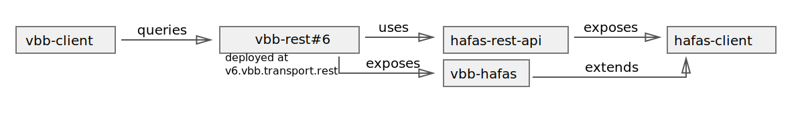

# vbb-rest

***vbb-rest* is a public transport REST API**, a clean alternative to the [VBB HAFAS API](https://github.com/public-transport/hafas-client/blob/e02a20b1de59bda3cd380445b6105e4c46036636/p/vbb/readme.md).

[**API documentation**](docs/readme.md)



[](https://stats.uptimerobot.com/57wNLs39M/784879520)
[](https://hub.docker.com/r/derhuerst/vbb-rest/)
[](https://david-dm.org/derhuerst/vbb-rest)

[](https://gitter.im/derhuerst)


## installing & running

`vbb-rest` expects a [Redis](https://redis.io/) server running on `127.0.0.1:6379` (default port), but you can set the `REDIS_URL` environment variable to change this.

### via Docker

A Docker image [is available as `derhuerst/vbb-rest:5`](https://hub.docker.com/r/derhuerst/vbb-rest:5).

```shell
docker run -d -p 3000:3000 derhuerst/vbb-rest:5
```

*Note:* The Docker image does not contain the Redis server.

### manually

```shell
git clone https://github.com/derhuerst/vbb-rest.git
cd vbb-rest
git checkout 5
npm install --production

redis-server &
npm start
```

To keep the API running permanently, use tools like [`forever`](https://github.com/foreverjs/forever#forever) or [`systemd`](https://wiki.debian.org/systemd).


## Related Projects

- [`bvg-rest`](https://github.com/derhuerst/bvg-rest) – A clean REST API wrapping around the BVG API.
- [`db-rest`](https://github.com/derhuerst/db-rest) – A clean REST API wrapping around the *Deutsche Bahn* API.
- [`hvv-rest`](https://github.com/derhuerst/hvv-rest) – A clean REST API wrapping around the HVV API.
- [`hafas-rest-api`](https://github.com/public-transport/hafas-rest-api) – Expose a HAFAS client via an HTTP REST API.
- [`hafas-client`](https://github.com/public-transport/hafas-client) – JavaScript client for HAFAS public transport APIs.


## Contributing

If you have a question or have difficulties using `vbb-rest`, please double-check your code and setup first. If you think you have found a bug or want to propose a feature, refer to [the issues page](https://github.com/derhuerst/vbb-rest/issues).
